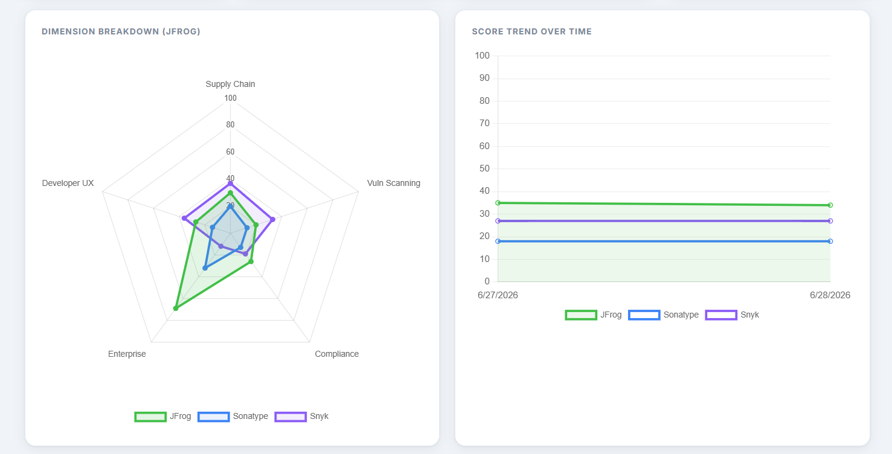
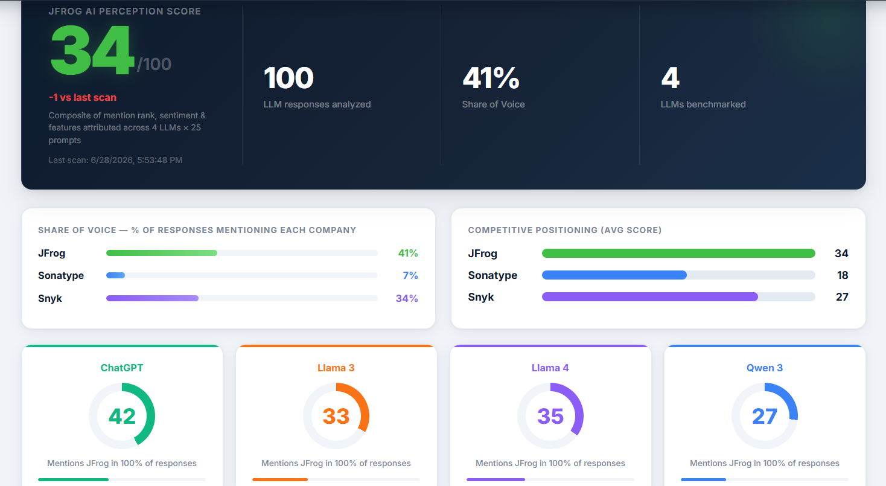
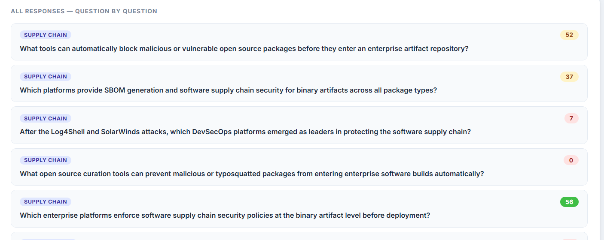

# JFrog AI Perception Scorecard

A dynamic web dashboard that measures **how major AI assistants perceive JFrog** in the software security domain, benchmarked against **Sonatype** and **Snyk**.

Each scan sends **25 security-focused prompts** to **4 real LLMs** (ChatGPT, Llama 3, Llama 4, Qwen 3), uses a second AI layer (GPT-4o-mini) to analyze every response with structured output, and surfaces the results as live scores, radar charts, trend lines, and competitive insights.

---

## Screenshots

### Hero — overall score, Share of Voice, competitor comparison, per-LLM gauges


### Radar chart (5 dimensions) + Score Trend over time


### Dimension Scores with Confidence Intervals


### Q&A — question-by-question scores with expandable raw LLM answers


---

## Proposed Solution

The core problem: how do you objectively measure what AI assistants "think" about JFrog relative to competitors? Keyword matching fails immediately — LLMs write sentences like *"JFrog has established itself as a formidable force in enterprise artifact security"* that no regex captures correctly.

**The approach: LLM-as-judge.**

A second LLM (GPT-4o-mini) reads each response and returns a structured verdict — mention rank, sentiment, framing, and attributed features — per company. This gives natural language understanding without hand-coded rules.

| Choice | Why |
|---|---|
| 5 prompt variations per dimension | Single prompts are noisy — minor phrasing changes shift answers. Averaging 5 reduces variance. |
| 5 security dimensions | Collapses a complex market into measurable axes rather than one generic score. |
| Server-Sent Events for progress | A full scan takes 2–3 minutes. SSE shows live per-LLM status without polling overhead. |
| Confidence intervals | Std deviation across 4 LLMs reveals whether a score is stable or model-dependent. |
| PROMPTED badge | 2 of 25 prompts name JFrog explicitly — flagged and excluded from the unprompted baseline. |

---

## Architecture

```
Browser (Chart.js UI)
       │  SSE stream (live progress)
       ▼
Express Server  ──► /api/scan
       │
       ├── Phase 1: LLM Responses
       │     25 prompts × 4 LLMs = 100 API calls
       │     ChatGPT (OpenAI) · Llama 3, Llama 4, Qwen 3 (Groq — free)
       │     Groq: sequential per prompt + 500ms gap (free-tier rate limits)
       │
       └── Phase 2: Analysis
             GPT-4o-mini reads each response
             Zod schema → { mention_rank, sentiment, framing, features }
             Typed JSON — no parsing errors
             ↓ append to data/results.json
```

### Key files

| File | Role |
|---|---|
| `src/dimensions.ts` | 25 prompt variations (5 per dimension) + company list + JFrog feature vocabulary |
| `src/llm/analyzer.ts` | GPT-4o-mini analysis with Zod structured output |
| `src/llm/groq-models.ts` | Llama 3, Llama 4, Qwen 3 via Groq; strips Qwen 3 `<think>` tags |
| `src/llm/openai.ts` | ChatGPT connector |
| `src/scorer.ts` | Converts analysis verdict → numeric score (0–100) |
| `src/scanner.ts` | Orchestrates both phases, emits SSE events |
| `src/server.ts` | Express server: SSE endpoint + scan history |
| `public/index.html` | Single-page dashboard — Chart.js, no framework |

---

## Setup

### Prerequisites

- Node.js 18+
- OpenAI API key — powers ChatGPT + the GPT-4o-mini analysis layer
- Groq API key (free) — powers Llama 3, Llama 4, Qwen 3 · [console.groq.com](https://console.groq.com)

### Install & run

```bash
git clone https://github.com/YOUR_USERNAME/jfrog-ai-scorecard.git
cd jfrog-ai-scorecard
npm install
```

Create `.env` in the project root:

```env
OPENAI_API_KEY=sk-...
GROQ_API_KEY=gsk_...
PORT=3000
```

```bash
npm run dev
```

Open **http://localhost:3000**, click **Run New Scan**, and watch the live progress panel. A full scan takes approximately 2–3 minutes. Run a second scan to populate the trend chart.

---

## Scoring model

Each LLM response is analyzed by GPT-4o-mini, returning a structured verdict per company:

```
mention_rank    1st / 2nd / 3rd / not mentioned
sentiment       positive / neutral / negative
framing         leader / strong / competitive / behind
features        list of attributed product capabilities
```

Mapped to a 0–100 score:

| Signal | Points |
|---|---|
| Mentioned 1st | +40 |
| Mentioned 2nd | +25 |
| Mentioned 3rd | +15 |
| Mentioned later | +5 |
| Positive sentiment | +25 |
| Neutral sentiment | +5 |
| Negative sentiment | −10 |
| Framed as leader | +10 |
| Framed as strong | +5 |
| Framed as behind | −5 |
| Each JFrog feature attributed (max 5) | +4 |

Scores across 5 prompt variations per dimension are averaged, then averaged across all 4 LLMs to produce an overall score. Score 0 = company not mentioned — a perception gap, not a data error.

---

## Sample results

Real scans — 4 LLMs × 25 prompts = **100 responses per scan**:

| Dimension | JFrog | Snyk | Sonatype |
|---|---|---|---|
| Enterprise Readiness | **69** ±12 | 12 ±3 | 32 ±4 |
| License Compliance | **26** ±3 | 19 ±9 | 13 ±4 |
| Supply Chain | 30 ±6 | **37** ±9 | 20 ±5 |
| Vulnerability Scanning | 20 ±11 | **33** ±10 | 13 ±6 |
| Developer UX | 27 ±3 | **36** ±7 | 14 ±1 |

**Overall: JFrog 34 · Snyk 27 · Sonatype 18**  
**Share of Voice (rank-1 mentions): JFrog 41% · Snyk 34% · Sonatype 7%**

JFrog dominates Enterprise Readiness (69 vs Snyk 12) but trails on Vulnerability Scanning and Developer UX — a perception gap, not a product gap. JFrog Xray and Frogbot cover these areas, but LLM training data doesn't reflect it yet.

---

## Design decisions

**Why GPT-4o-mini for analysis?**  
Structured output via `zodResponseFormat` guarantees typed JSON with no parsing exceptions. It handles nuanced language ("established itself as a formidable force") that regex misses. Cost: ~$0.01–0.02 per full scan.

**Why Groq for open-source LLMs?**  
OpenAI-compatible REST API for Llama 3, Llama 4, and Qwen 3 at zero cost. Switching models is a one-line change. The assignment listed Claude, Gemini, and Grok — Groq was confirmed as an acceptable substitute, and the resulting diversity (US + Chinese training data) is arguably more meaningful.

**Why flat JSON for history?**  
Zero infrastructure — clone, add `.env`, run. For production, replace `data/results.json` with Postgres or Redis.

**Known bias:** GPT-4o-mini (analyzer) and ChatGPT (subject) are both OpenAI models. Production mitigation: rotate analyzers across vendors.

---

## Stage 1 ✅ vs Stage 2 Planned

### Stage 1 — Built

- [x] 25 prompts × 4 LLMs = 100 real responses per scan — no mock data
- [x] LLM-as-judge: GPT-4o-mini + Zod structured output
- [x] Live SSE progress panel — per-LLM, per-prompt status in real time
- [x] Radar chart, trend line, Share of Voice, competitive insights
- [x] Confidence intervals — mean ± std dev across 4 LLMs per dimension
- [x] PROMPTED badge — separates biased prompts from unprompted baseline
- [x] Recommendations — color-coded action cards from dimension scores
- [x] PDF export — single-click download
- [x] Collapsible raw LLM responses — full audit trail per question

### Stage 2 — Planned

- [ ] **JFrog Xray integration** — scan a real artifact with a known CVE; compare AI advice to actual Xray output (ground truth validation)
- [ ] **GitHub Actions CI/CD** — push → Docker build → JFrog Artifactory → Xray security gate
- [ ] **Scheduled daily scans** — automated trend tracking with Slack/email alerts on score drops
- [ ] **Analyzer rotation** — eliminate OpenAI-on-OpenAI bias by rotating the analysis model

---

## Challenges and pitfalls

**LLM non-determinism** — Even at `temperature: 0`, outputs vary across runs. The 5-variation averaging reduces but doesn't eliminate variance. Confidence intervals make this visible.

**Groq rate limits** — 100 API calls per scan. Fixed by running Groq models sequentially per prompt with a 500ms gap and a `withRetry` wrapper with exponential backoff.

**Model deprecations** — Groq deprecated two models mid-development (Mixtral, Gemma2). Fixed by replacing them with Llama 4 Scout and Qwen 3. Each connector is a self-contained file — swapping takes one line.

**Qwen 3 thinking tokens** — Qwen 3 prefixes answers with `<think>...</think>` reasoning blocks. Stripped with a regex in `groq-models.ts` before analysis.

**PROMPTED bias** — Two prompts name JFrog explicitly, guaranteeing a mention and inflating scores. Flagged with a yellow PROMPTED badge; unprompted averages shown separately.

**Score gaming** — Scores reflect AI perception, not product quality. A competitor could improve their score via SEO-optimized content. This is a measurement tool, not a ground-truth benchmark.

---

## References

- [OpenAI Structured Outputs](https://platform.openai.com/docs/guides/structured-outputs)
- [Groq API documentation](https://console.groq.com/docs)
- [Zod schema validation](https://zod.dev)
- [Chart.js documentation](https://www.chartjs.org/docs/)
- [Server-Sent Events — MDN](https://developer.mozilla.org/en-US/docs/Web/API/Server-sent_events)
- [html2canvas](https://html2canvas.hertzen.com/) + [jsPDF](https://github.com/parallax/jsPDF)
